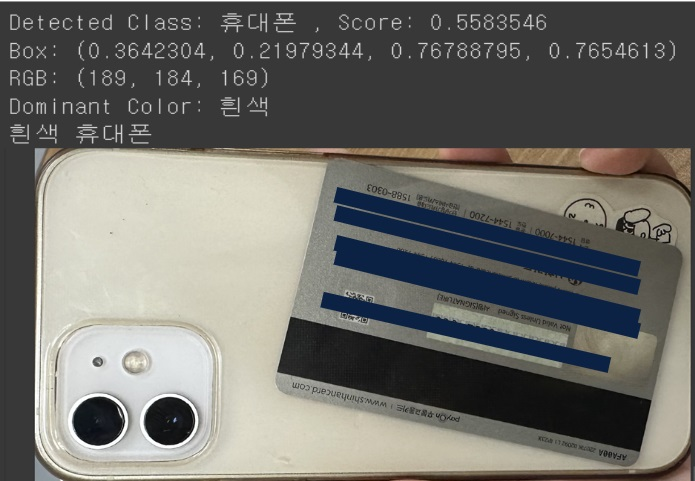

# GraduationPrject
## Lost&Found Vision

The 'Lost&Found Vision' project is a community-based lost and found recognition and sharing application. This application utilizes location-based services and image processing technology to automatically recognize and categorize lost items, sharing them with the community to assist in their recovery.

### Overall Process

1. **User Finds an Object**: Display an image of a person discovering a lost item and picking it up.
2. **Photo Capture**: Show the user taking a picture of the item with their smartphone.
3. **Object Detection**: Illustrate the app interface with the uploaded photo, highlighting the item with a bounding box as the app analyzes the image. 
  

4. **Information Extraction**: Present the app identifying and extracting features such as color, shape, or any distinctive marks and categorizing the information into four levels: major category, intermediate category, minor category, and final classification, for storage in a database. 
    
   

5. **Location Tagging**: Include a graphic or icon that signifies the recording or inputting of the item's location, such as a map icon. 
   

6. **Database Upload**: Demonstrate that the extracted information is being uploaded to a database, indicated by a cloud upload icon or similar imagery. 
     

7. **Community Sharing**: Depict how the item's information is shared within a community or network, possibly shown as interconnected user profiles or icons.
8. **Owner Searches and Finds Item**: Finally, show a pleased owner locating their lost item through the app, with an image of a joyful reunion with the item.

### Instructions for Use
1. **Uploading an Item:**
   - Launch the application and select the "Upload Item" feature.
   - Provide an image and information about the item you wish to upload.
   - Click the upload button to post your item.

2. **Searching for an Item:**
   - Use the "Search for Item" function to find items using keywords or categories.
   - Review the search results and locate the item of interest.

3. **Setting Notifications:**
   - In the "Notifications" menu, set up alerts for your desired keywords.
   - Receive notifications when an item related to your specified keywords is uploaded.

## Database

## Map
Obtaining and using Naver Map API permission from Naver Cloud Platform
 

In-app Map Execution Screen
 

- Marking Seoul's administrative autonomous districts with markers
- Display the name of the administrative autonomous districts on the marker

## Object Detection
Use Tensorflow Object Detection api to detect objects. 

[API] : https://github.com/tensorflow/models/tree/master/research/object_detection

This api is pretrained model that used COCO Dataset.

We added AirPods and wallets to the label map according to the characteristics of our application.

- [Wallet dataset] : https://universe.roboflow.com/project-a5ktq/wallets/dataset/2

- [Airpod dataset] : https://universe.roboflow.com/yolov5-oi1fm/detect-airpod/dataset/2

Output of detection

## Description about files (Explanation of codes)

 
You can see a description of the files through the link below. 
https://github.com/berry1015/fortest/blob/main/README.md

## 기술 스택
- 프론트엔드: Flutter
- 데이터베이스: Firebase
- 이미지 처리: OpenCV
- 지도 서비스: Naver API

----------------------------------------------------
## Badges that We used in this project

